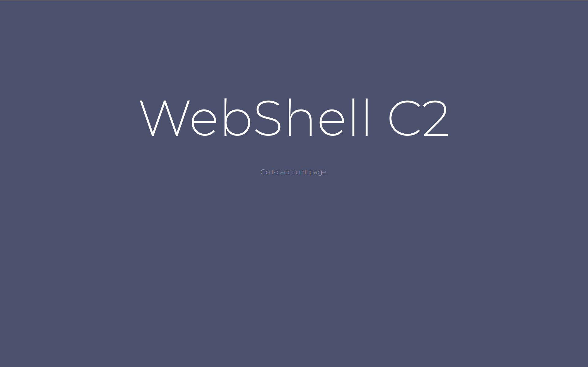
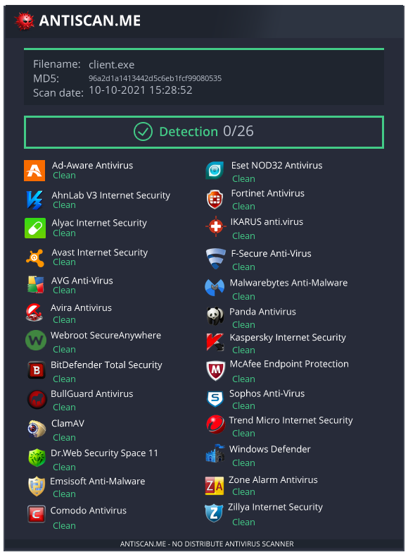
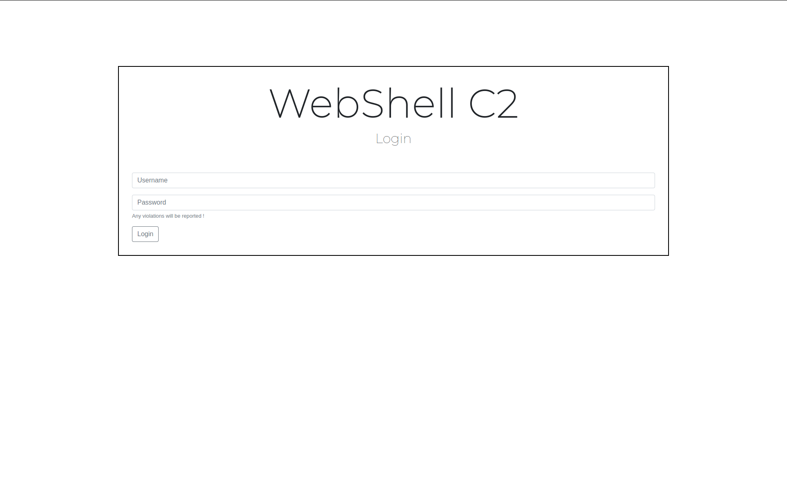
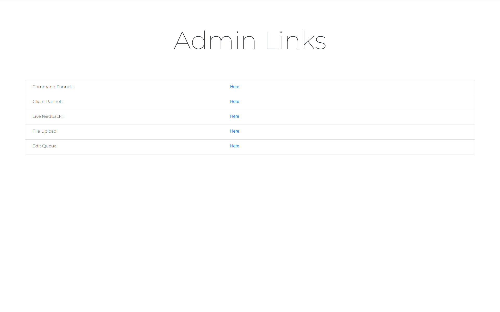
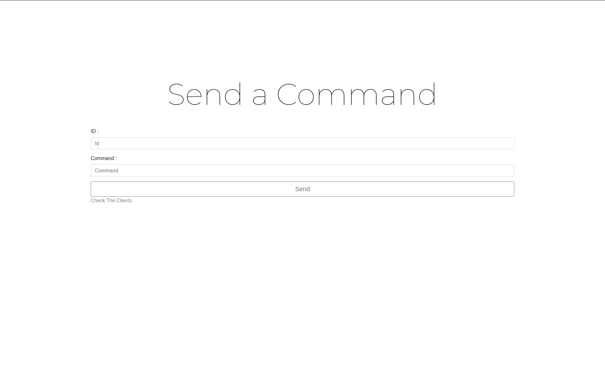
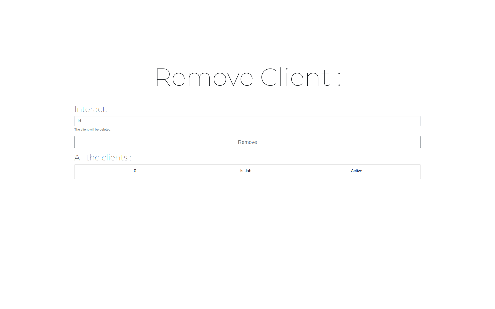
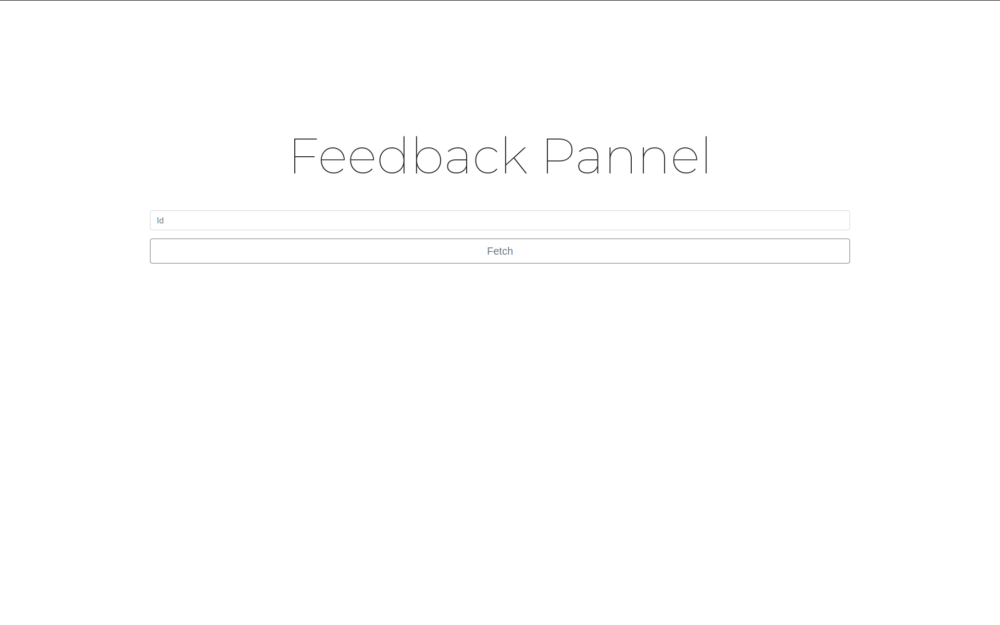
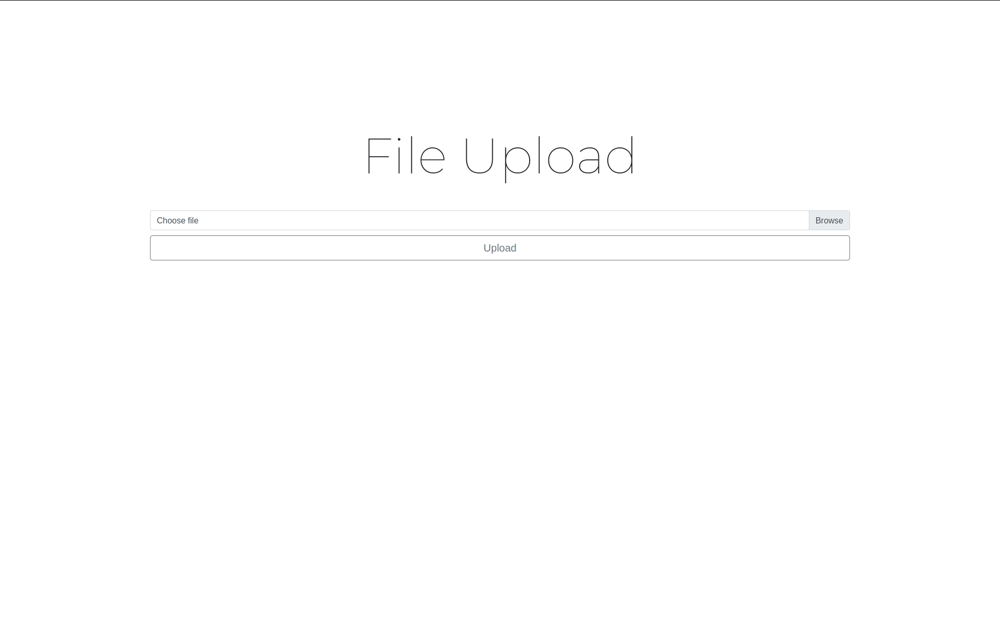
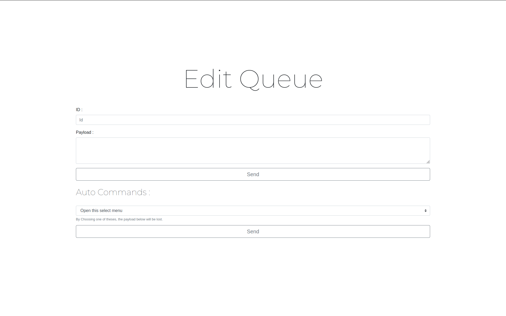

# WebShell C2
Web Based C2

VERSION : v1.0




## Presentation

Webshell C2 is a c2 that use only GET requests to gain access on a device.

## Usage

### Linux/Windows :

#### Install
```sh
python3 server.py
```
or
```sh
docker build ./
docker run -it <name>
```
#### Uninstall
```sh
rm -rf WebShell-C2/
```
```sh
docker system prune -a
```

### Security and program

|  Options   | Webshell C2 |
|------------|-----------------|
| Secured Session | Y       |
| In developement    | Y       |
| Web Interface   | Y       |
|Gui interface | N |
|Total lines | 1273 |


### Features to come :

* Load mimikatz in memory.
* Auto Pivoting.
* Go Shellcode execution implant (Syscall, CreateRemoteThread).
* Persistance.


### Features :

* FUD.
* Send Commands.
* Python command execution.
* FUD Shell migration.
* Run DLL.
* Only Get Requests.
* Docker Support + Detection.
* Web Interface.
* Queue / Single commands support.
* Lnk persistence.


## Media
### Detection for Dev Client


### Login


### Index


### Commands Panel


### Remove Client


### FeedBack Panel


### File Upload


### Edit Queue


## Legal

Usefull Info:
* Remove all the files generated by the app with clean.sh.
* Informations are only stored in your computer.
* Project only for educational purposes.

## Project Info

Back-End / Front-End / Code : [Ph3nX](https://github.com/Ph3nX-Z)

## Supporters:
[](https://github.com/Ph3nX-Z/WebShell-C2/stargazers)

## Contributing

1. Fork it (<https://github.com/yourname/yourproject/fork>)
2. Create your feature branch (`git checkout -b feature/fooBar`)
3. Commit your changes (`git commit -am 'Add some fooBar'`)
4. Push to the branch (`git push origin feature/fooBar`)
5. Create a new Pull Request
